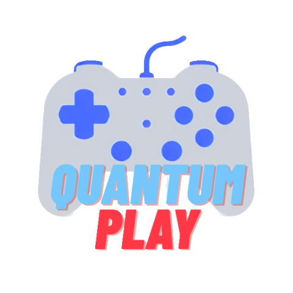

# 🎮 QuantumPlay

> A premium, modern, and ultra-fast universal game launcher built with Electron, React, and TypeScript. Say goodbye to scattered game libraries and heavy launch clients.

---

<p align="center">
  
</p>

<p align="center">
  <strong>QuantumPlay</strong> è un client universale e leggero progettato per riunire tutti i tuoi videogiochi in un'unica, splendida libreria interattiva. Rileva automaticamente i tuoi giochi installati da molteplici launcher (Steam, Epic Games, Ubisoft Connect, Rockstar Games, GOG Galaxy) ed offre un controllo completo con un'interfaccia personalizzabile, animazioni fluide ed un design moderno stile <em>Glassmorphic</em>.
</p>

<p align="center">
  <a href="#-features">Caratteristiche</a> •
  <a href="#-tecnologie">Tecnologie</a> •
  <a href="#-installazione">Installazione</a> •
  <a href="#%EF%B8%8F-configurazione">Configurazione</a>
</p>

---

## ✨ Features

* 🚀 **Auto-Scansione Launcher**: Rileva istantaneamente i giochi installati sul tuo PC da **Steam, Epic Games, Rockstar Games, GOG Galaxy e Ubisoft Connect**, recuperando statistiche come tempo di gioco e data dell'ultima sessione.
* ➕ **Aggiunta Manuale con Copertine**: Aggiungi qualsiasi gioco, applicazione o eseguibile non presente nei launcher ufficiali. Puoi scegliere un'immagine personalizzata per la copertina e per lo sfondo dei dettagli del gioco.
* 📁 **Categorie Personalizzate Drag & Drop**: Crea categorie personalizzate proprio come su Steam! Trascina i tuoi giochi all'interno delle categorie nella sidebar per organizzarli. Clicca con il tasto destro per rimuovere un gioco da una categoria al volo.
* 💖 **Preferiti e Stellina Animata**: Aggiungi i tuoi giochi preferiti con un click! Il sistema illuminerà l'icona del cuore in fucsia ed aggiungerà un'elegante stellina accanto al titolo nella sidebar.
* 🎯 **Controllo dei Giochi in Esecuzione**: Quando avvii un gioco, QuantumPlay lo monitora. Se decidi di interrompere la sessione, al posto dello stato "In esecuzione" troverai un comodo **pulsante rosso "Chiudi Gioco"** per forzare l'arresto immediato del processo.
* 🎨 **Design System HSL & Temi Persistenti**: Scegli tra bellissimi temi pronti all'uso (Oscuro, Chiaro, Cyberpunk, Foresta, Deep Ocean) o crea il tuo tema personalizzato regolando i gradienti, i testi e i colori RGB. Le preferenze vengono salvate in modo permanente nel database.
* 🔒 **Single Instance Lock**: Impedisce l'avvio di copie multiple dell'applicazione in background. Se provi a riaprire l'app, l'istanza corrente viene mostrata e messa a fuoco automaticamente sullo schermo.
* ⚙️ **Riduci ad Icona alla Chiusura**: Chiudi la finestra nel System Tray (barra di sistema vicino all'orologio) per mantenerla attiva in background senza consumare risorse visive.
* 🗑️ **Disinstallazione Pulita con Popup Dedicato**: Rimuovi l'applicazione in modo sicuro con un'opzione per ripulire completamente anche tutti i dati utente, database dei giochi, statistiche e temi memorizzati in `%AppData%/QuantumPlay`.

---

## 🛠️ Tecnologie

* **Core**: [Electron](https://www.electronjs.org/) & [Node.js](https://nodejs.org/)
* **Frontend**: [React 19](https://react.dev/) & [TypeScript](https://www.typescriptlang.org/)
* **Build Tool**: [Vite](https://vite.dev/) & [Vite-Plugin-Electron](https://github.com/electron-vite/vite-plugin-electron)
* **Styling**: Vanilla CSS con Variabili HSL Dinamiche, effetti *Glassmorphism* (Backdrop-filter) e animazioni in CSS3.
* **Database**: File JSON locale memorizzato in modo asincrono per massimizzare la velocità di lettura/scrittura.

---

## 📦 Installazione

Puoi compilare o scaricare direttamente i file pronti all'uso per Windows contenuti nella cartella `dist-release/`:

1. **`QuantumPlay Setup 1.0.0.exe`**: Il pacchetto di installazione standard di Windows per configurare il launcher permanentemente sul PC con collegamenti sul Desktop e nel menu Start.
2. **`QuantumPlay 1.0.0.exe`**: La versione portatile *standalone* che non richiede installazione ed è pronta all'uso con un semplice doppio clic!

---

## ⚙️ Sviluppo e Compilazione Locale

Per clonare il codice ed eseguire QuantumPlay in modalità sviluppo o pacchettizzarlo:

### Prerequisiti
* [Node.js](https://nodejs.org/) (consigliato v18+)
* npm (incluso con Node.js)

### 1. Clona la repository ed installa le dipendenze
```bash
git clone https://github.com/tuo-username/QuantumPlay.git
cd QuantumPlay
npm install
```

### 2. Avvia in modalità Sviluppo (con Hot-Reloading)
```bash
npm run dev
```

### 3. Compila l'applicazione per la produzione (.exe setup e portatile)
```bash
npm run build
```
I file compilati con l'icona ufficiale saranno posizionati all'interno della cartella `dist-release/`.

---

<p align="center">
  Made with 💖 by MrSkele
</p>
